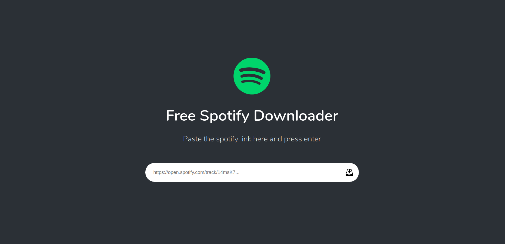
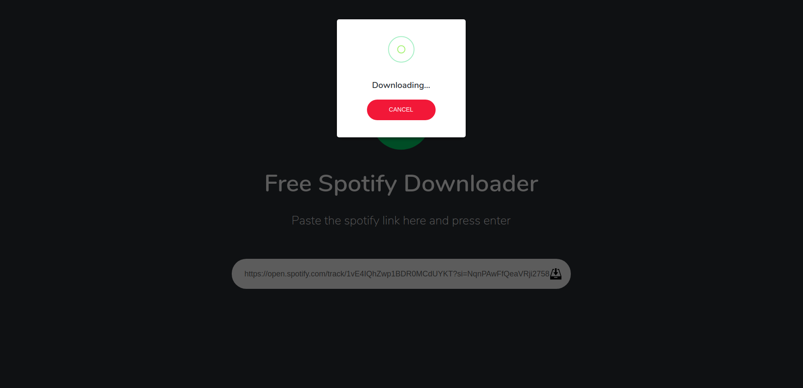

# Simple Spotify Downloader

Simple spotify downloader web application uses <a href="https://github.com/ritiek/spotify-downloader" target="_blank">spotify-downloader</a> repository by <a href="https://github.com/ritiek" target="_blank">ritiek</a>.

Also uses <a href="https://github.com/Automattic/kue">Kue</a> by <a href="https://github.com/Automattic">Automattic</a> to handle queue jobs.

## Requirements

- nodejs 8 or 10
- redis

## Installation

Run `npm install`

Rename `.env.example` to `.env` and config it.

## Run

- Run `node server.js` for starting server
- Run `node worker.js` for starting worker to download tracks

## Tests

Run `npm test`

## ESLint

Run `npm run lint`

## Screenshot

## License

This repo is open-sourced software licensed under the MIT license.
